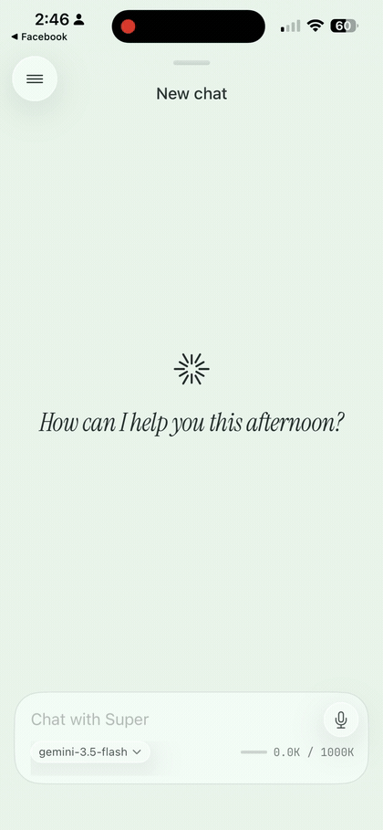
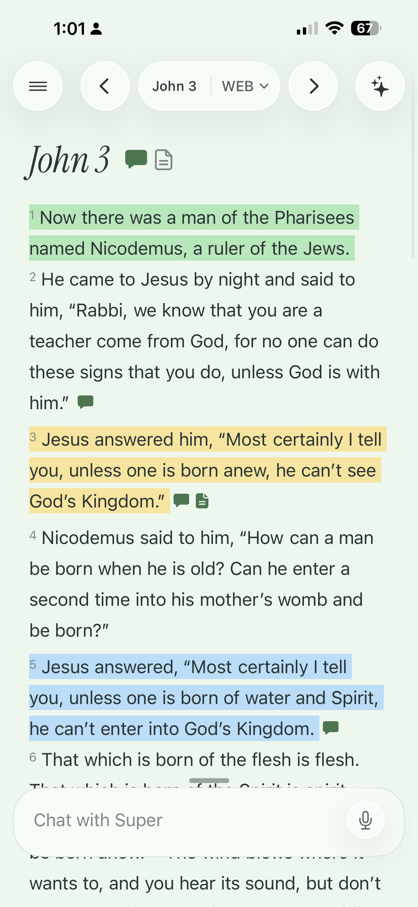
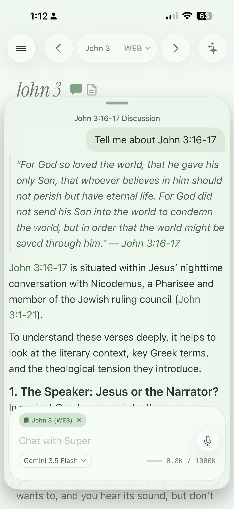
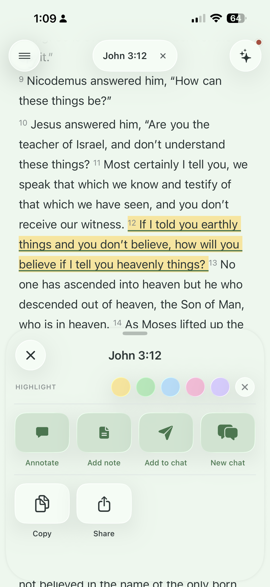
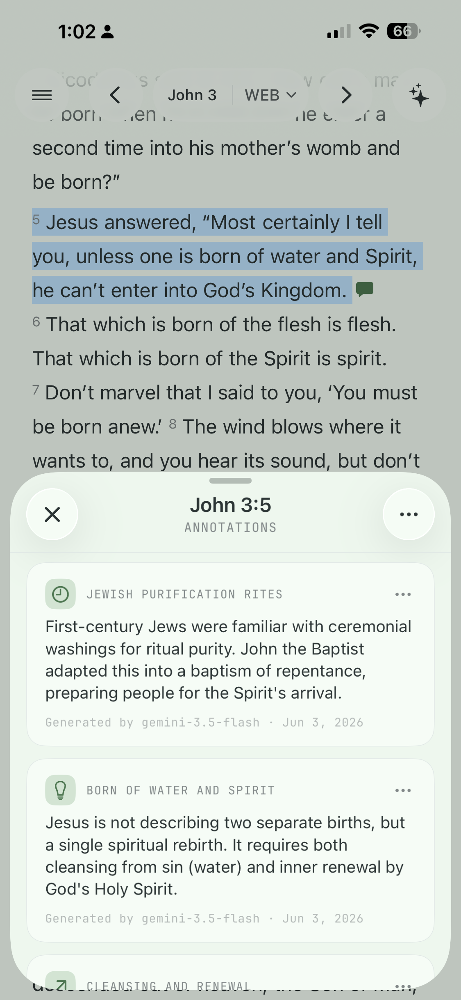
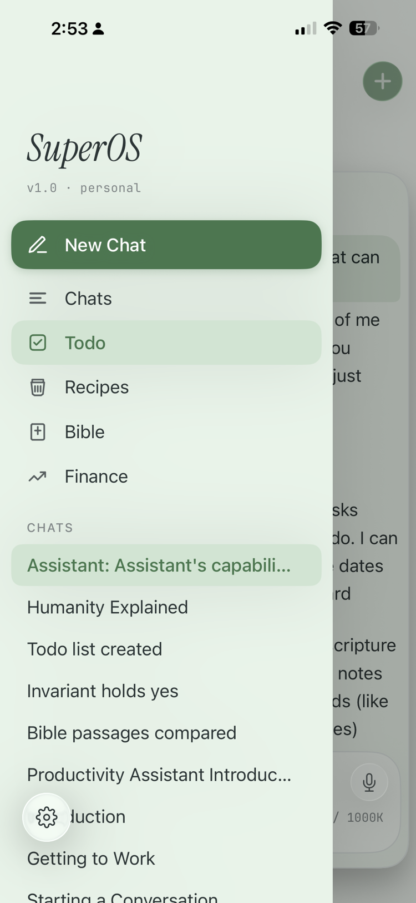
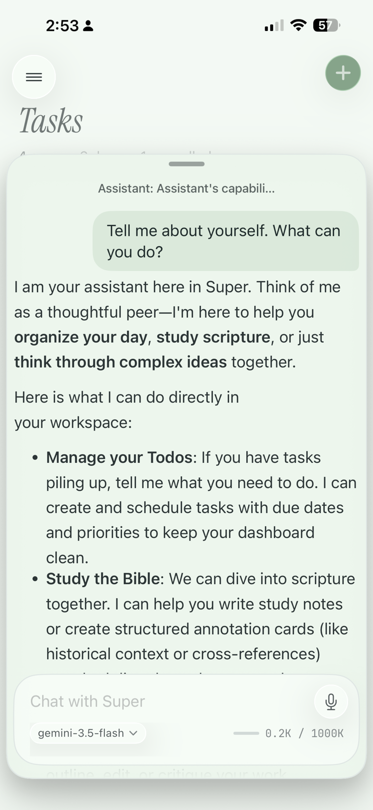
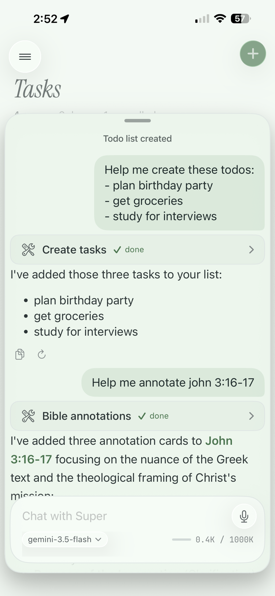

# Super

<p align="center">
  
</p>

[](https://github.com/brianwang9100/Super/actions/workflows/swift-test.yml)
[](https://github.com/brianwang9100/Super/actions/workflows/ios-build.yml)
[](https://github.com/brianwang9100/Super/actions/workflows/swiftlint.yml)
[](https://github.com/brianwang9100/Super/actions/workflows/secrets-scan.yml)

**One codebase, a family of chat-first AI apps.** The flagship is **SuperBible** — a free, open-source, BYOK AI study Bible heading to the App Store.

---

## Design philosophy

- **Chat is the host**, not a tab. Mini-apps render *behind* the chat in coordinated overlay states.
- **Bi-directional AI.** Chat drives mini-apps via tool calls; mini-apps pipe records back into chat with a tap.
- **Offline-first.** GRDB/SQLite on-device is the source of truth. On-device LLMs (Apple Foundation Models, MLX) are first-class; cloud endpoints are optional.
- **BYOK & open source.** No API keys ship in the binary — users provide their own, stored in the iOS Keychain.

## The apps

All three are built from the same `Core`, `Chat`, and `Bible` packages — they differ only in which mini-apps each composition root registers at launch.

| App | What it is | Status |
|---|---|---|
| 📖 **SuperBible** | The flagship. A free, open-source, **BYOK**, local-first AI **study Bible**: read scripture, generate AI study annotations, take notes, and chat about what you're reading. | **Heading to the App Store** |
| 🧩 **SuperOS** | The broader multi-mini-app shell SuperBible grew out of — Chat host + ToDo + more, all driven by AI. The founder's personal app. | Personal, not App Store-bound |
| 💬 **SuperChat** | A dead-simple chat app for people who just want to talk to their local LLM. | Future |

See [`docs/superpowers/specs/2026-05-23-superbible-fork-design.md`](docs/superpowers/specs/2026-05-23-superbible-fork-design.md) for the fork rationale, and [`docs/PRODUCT_VISION.md`](docs/PRODUCT_VISION.md) for the long-form vision.

## SuperBible in action

<table>
  <tr>
    <td width="50%" align="center">
      <br>
      <sub><b>A reader built for focus</b><br>Clean, typographic chapter reading that gets out of your way.</sub>
    </td>
    <td width="50%" align="center">
      <br>
      <sub><b>Read + chat, together</b><br>A floating chat panel over the reader, with the verse you're reading piped into the conversation.</sub>
    </td>
  </tr>
  <tr>
    <td width="50%" align="center">
      <br>
      <sub><b>Tap any verse</b><br>Highlight, annotate, take a note, or send it straight into chat.</sub>
    </td>
    <td width="50%" align="center">
      <br>
      <sub><b>AI study annotations</b><br>Context, cross-references, and explanation generated for the passage you're on.</sub>
    </td>
  </tr>
</table>

## SuperOS in action

<table>
  <tr>
    <td width="33.33%" align="center">
      <br>
      <sub><b>One sidebar, your whole workspace</b><br>Jump between chats or switch mini-apps — ToDo, Recipes, Bible, Finance — from a single drawer.</sub>
    </td>
    <td width="33.33%" align="center">
      <br>
      <sub><b>Chat that reads well</b><br>A polished chat experience with full Markdown support — headings, bold, and clean bulleted lists.</sub>
    </td>
    <td width="33.33%" align="center">
      <br>
      <sub><b>Talk to your mini-apps</b><br>Tool calls let chat act for you — create tasks, annotate scripture — with each step shown inline.</sub>
    </td>
  </tr>
</table>

## Why I built this

I started this as a personal project with two goals: to really understand how LLMs work under the hood, and to take on the challenge of designing a chat app that actually feels well-built — not another bolted-on chatbot.

The itch was practical, too. I was tired of having fifteen different apps on my phone for the things I do every day — todos, finance, the smart home, Bible reading. I wanted **one** app that could do all of it, with an AI chat at the center. The end goal: an app of mini-applets I could drive entirely through conversation — "add four things to my to-do list," "pull up a recipe," "turn off the garage lights," "check the camera," "give me a verse of the day."

My first MVP was **SuperOS**, where I poured the work into making the chat experience genuinely polished. But as I kept building, I realized I wanted to actually *ship* something. SuperOS was too broad and generic to do any one thing really well — so I narrowed my focus to **SuperBible**. Because I'd architected the app so mini-apps are configurable, SuperBible ended up being a focused, stripped-down SuperOS rather than a rewrite.

I chose the Bible because I couldn't find a free AI Bible-study app that genuinely looked and felt good. Open-source and BYOK (Bring Your Own Key) made for a clean MVP — aimed first at technical people who want an AI-centric Bible app. I may explore monetization later, but this is the right place to start.

## Features

| Area | What you get |
|---|---|
| **Chat** | Talk to most frontier providers (OpenAI, Anthropic, Google) and **any OpenAI-compatible endpoint** (Ollama, vLLM, LM Studio, …) — BYOK. Apple Foundation Models runs on-device by default: free, offline, no key. Markdown rendering and automatic conversation compaction. |
| **Web search** | Native web search for the three top frontier models — **OpenAI, Claude, and Gemini**. |
| **Tools** | Local, on-device tool use — get the current time, annotate a Bible passage, and more. |
| **Bible** | Four public-domain translations (**WEB, ASV, KJV, BSB**). Highlights, notes, AI study annotations, and voiceover narration. |
| **Appearance** | Light and dark themes, plus adjustable font scaling. |
| **Privacy** | Everything is persisted on-device — nothing reaches a server. BYOK API keys live in the iOS Keychain and never leave the phone. |

## Set up & run

**Prereqs:** macOS 15+, Xcode 26+, [XcodeGen](https://github.com/yonaskolb/XcodeGen) (`brew install xcodegen`).

```bash
git clone https://github.com/brianwang9100/Super.git
cd Super
xcodegen generate          # produces Super.xcodeproj from project.yml
open Super.xcodeproj
```

Two app schemes are generated:

- **`SuperBible`** — the flagship study-Bible app (Chat + Bible).
- **`Super`** — the SuperOS personal app (Chat + Bible + ToDo).

Pick a scheme + an iPhone simulator and ⌘R. On first launch the app seeds **Apple Foundation Models** as the default chat model (free, on-device, no key). To use a stronger model, open **Settings → Models** and add a chat-completions endpoint (Ollama, vLLM, LM Studio, OpenAI, Anthropic, etc.) plus an API key. **Keys live in the iOS Keychain — they never leave the device.**

To build from the command line instead:

```bash
# SuperBible (flagship)
xcodebuild build \
  -project Super.xcodeproj \
  -scheme SuperBible \
  -destination 'platform=iOS Simulator,name=iPhone 17,OS=latest' \
  CODE_SIGNING_ALLOWED=NO

# SuperOS
xcodebuild build \
  -project Super.xcodeproj \
  -scheme Super \
  -destination 'platform=iOS Simulator,name=iPhone 17,OS=latest' \
  CODE_SIGNING_ALLOWED=NO
```

### Tests

Each Swift package owns its own test suite:

```bash
swift test --parallel                          # from Packages/Core/, Packages/Chat/, Packages/Bible/, …
xcodebuild test \                              # snapshot tests need an iOS sim
  -project Super.xcodeproj -scheme Chat \
  -destination 'platform=iOS Simulator,name=iPhone 17,OS=latest'
```

CI runs both on every push. Coverage thresholds (per [`AGENTS.md`](AGENTS.md)): Core ≥ 80%, applets ≥ 70%.

## Contributing

This is an experimental project and the codebase moves quickly. If you want to dig in:

1. Read [`docs/PRODUCT_VISION.md`](docs/PRODUCT_VISION.md), [`docs/DESIGN.md`](docs/DESIGN.md), and [`docs/MOBILE_ARCHITECTURE.md`](docs/MOBILE_ARCHITECTURE.md). For SuperBible specifics, start with [`docs/SuperBible/OVERVIEW.md`](docs/SuperBible/OVERVIEW.md).
2. Skim [`AGENTS.md`](AGENTS.md) — it codifies the conventions every PR follows (Swift 6 strict concurrency, GRDB naming, structs-vs-classes, testing rules).
3. See [`TODO.md`](TODO.md) for what's open.

## License

[MIT](LICENSE) © 2026 Brian Wang.
