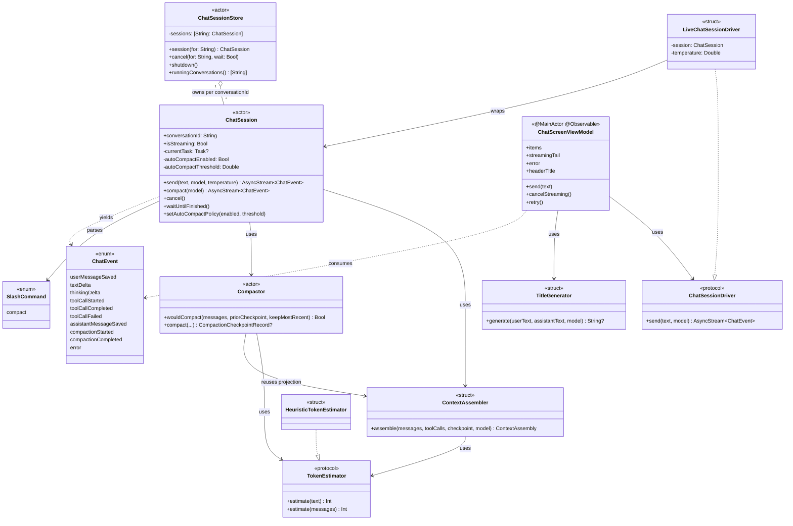
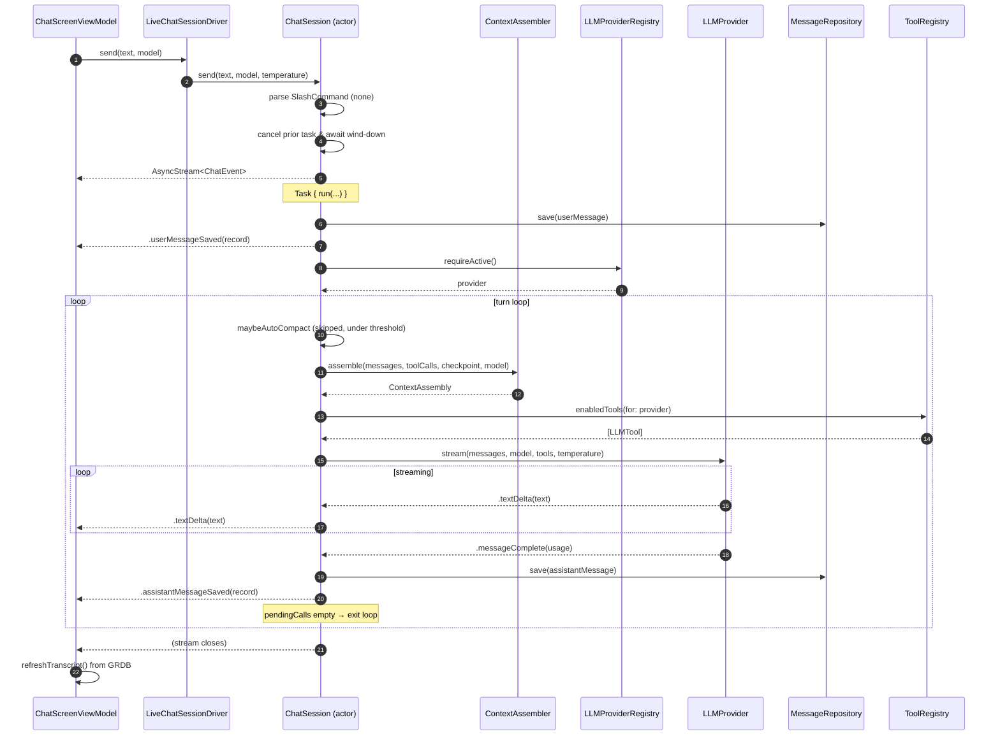
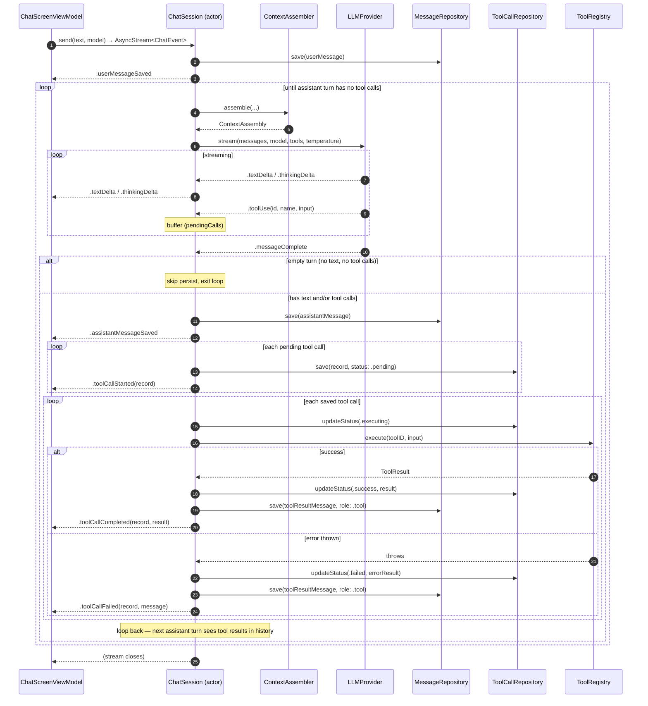
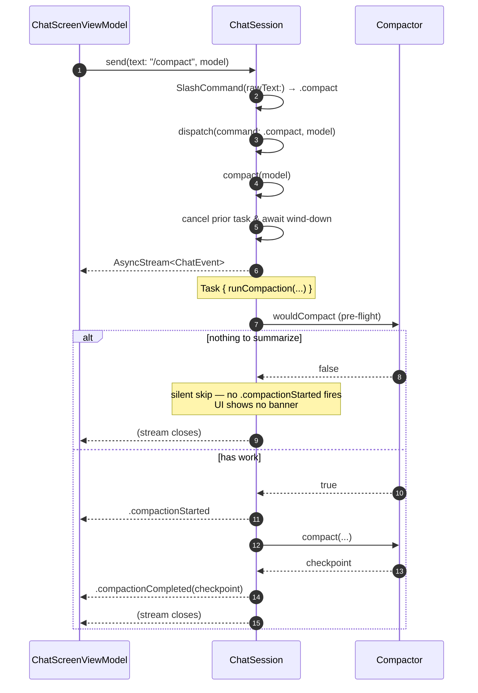
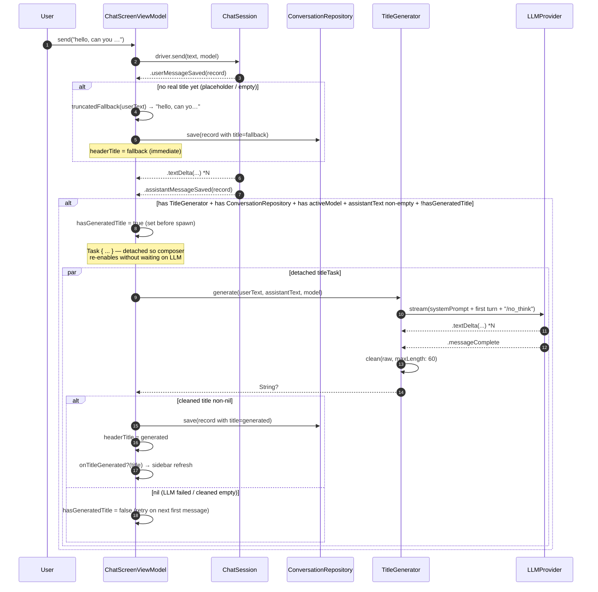

# Chat: Orchestration

Companion to [`ARCHITECTURE.md`](./ARCHITECTURE.md) §5 with full sequence
diagrams. Reflects the as-shipped code in
`Packages/Chat/Sources/Chat/Orchestration/` and the consuming
`ChatScreenViewModel`.

> Type-suffix taxonomy (`*Session`, `*Store`, `*Repository`, etc.) lives in
> [`docs/NAMING_CONVENTIONS.md`](../NAMING_CONVENTIONS.md). This doc uses
> those conventions throughout.

## Table of contents

1. [Overview](#1-overview)
2. [Object catalogue](#2-object-catalogue)
3. [Type hierarchy and dependencies](#3-type-hierarchy-and-dependencies)
4. [`ChatEvent` stream contract](#4-chatevent-stream-contract)
5. [Sequence: simple turn (no tools)](#5-sequence-simple-turn-no-tools)
6. [Sequence: tool-loop turn](#6-sequence-tool-loop-turn)
7. [Sequence: auto-compaction before a turn](#7-sequence-auto-compaction-before-a-turn)
8. [Sequence: manual `/compact`](#8-sequence-manual-compact)
9. [Sequence: title generation](#9-sequence-title-generation)
10. [Concurrency, lifetimes, and cancellation](#10-concurrency-lifetimes-and-cancellation)

---

## 1. Overview

Orchestration is the layer between the SwiftUI view model and the LLM
provider plus the GRDB repositories. Its job is to drive the **turn loop**
for a conversation: persist the user message, stream from the active
provider, fold tool calls, write the resulting records, and emit a
view-model-facing event stream.

Three actor boundaries matter:

- **`ChatSessionStore`** — singleton actor, owns one `ChatSession` per
  `conversationId`. View models look up their session through the store.
- **`ChatSession`** — actor, one per conversation. Owns the in-flight
  turn task, the auto-compaction policy, and the cancellation fence.
- **`Compactor`** — actor, stateless beyond its dependencies. Shared by
  every `ChatSession` in the store.

Everything else in the folder (`ContextAssembler`, `TitleGenerator`,
`TokenEstimator`, `SlashCommand`, `ChatEvent`) is a `struct`/`enum` value
type with no shared mutable state.

The view-model side (`ChatScreenViewModel`) is `@MainActor @Observable`
and talks to the session through a small `ChatSessionDriver` protocol —
the protocol exists so unit tests can substitute a fake driver without
spinning up GRDB or an LLM.

## 2. Object catalogue

| Type | Kind | File | Responsibility |
| --- | --- | --- | --- |
| `ChatSessionStore` | `public actor` | `Orchestration/ChatSessionStore.swift` | App-level coordinator: `session(for:)`, `cancel(for:wait:)`, `shutdown()`, `runningConversations()`. Holds `[conversationId: ChatSession]`. |
| `ChatSession` | `public actor` | `Orchestration/ChatSession.swift` | Owns the turn loop for one conversation. Public surface: `send(text:model:temperature:)`, `compact(model:)`, `cancel()`, `waitUntilFinished()`, `setAutoCompactPolicy(enabled:threshold:)`, `isStreaming`. |
| `ChatEvent` | `public enum` (`Sendable, Equatable`) | `Orchestration/ChatEvent.swift` | View-facing stream payload. See §4. |
| `ContextAssembler` | `public struct` (`Sendable`) | `Orchestration/ContextAssembler.swift` | Projects `[MessageRecord]` + `[ToolCallRecord]` + optional `CompactionCheckpointRecord` into `[LLMMessage]`. Folds in the checkpoint as a synthetic leading system message and preserves true-leading `.system` rows. Computes `totalTokens` via the injected `TokenEstimator`. |
| `ContextAssembly` | `public struct` (`Sendable, Equatable`) | `Orchestration/ContextAssembler.swift` | Return value of `ContextAssembler.assemble`. Carries `messages`, `totalTokens`, `maxTokens`, and `isOverThreshold(_:)`. |
| `Compactor` | `public actor` | `Orchestration/Compactor.swift` | Runs a summarization turn through the active provider and persists a `CompactionCheckpointRecord`. Exposes `wouldCompact(...)` as a pure predicate so callers can decide whether work exists without paying for an LLM call. |
| `CompactorError` | `public enum: Error` | `Orchestration/Compactor.swift` | `.emptySummary`, `.llmError(LLMError)`. |
| `TitleGenerator` | `public struct` (`Sendable`) | `Orchestration/TitleGenerator.swift` | Generates a 3–6-word title from the first user/assistant exchange via the active provider's stream. Returns `nil` on any failure path — caller leaves the existing title alone. |
| `SlashCommand` | `public enum` (`Sendable, Equatable`) | `Orchestration/SlashCommand.swift` | Composer-side dispatch. Today: `.compact`. Parsed at `ChatSession.send(text:...)` entry. |
| `TokenEstimator` | `public protocol` (`Sendable`) | `Orchestration/TokenEstimator.swift` | `estimate(_:) -> Int`. Default extension `estimate(messages:)` sums per-block text across an `[LLMMessage]`. |
| `HeuristicTokenEstimator` | `public struct: TokenEstimator` | `Orchestration/TokenEstimator.swift` | `chars/4` heuristic (rounded up). MVP estimator. |
| `ChatSessionDriver` | `public protocol` (`Sendable`) | `ViewModels/ChatScreenViewModel.swift` | `send(text:model:) async -> AsyncStream<ChatEvent>`. View-model's seam onto the session. |
| `LiveChatSessionDriver` | `public struct: ChatSessionDriver` | `ViewModels/ChatSessionDriver+Adapter.swift` | Production conformer. Wraps a `ChatSession` and threads the temperature default that the protocol signature doesn't carry. |
| `ChatScreenViewModel` | `@MainActor @Observable public final class` | `ViewModels/ChatScreenViewModel.swift` | Consumer. Owns transcript items, the in-flight `streamingTail` overlay, composer text, error banner, model selection, voice controller, and the auto-titler. Folds `ChatEvent`s into observable state. |

External collaborators (from `Core` or other folders in `Chat`):

- `LLMProviderRegistry` (`Core`) — yields the active provider via
  `requireActive()`; throws `LLMProviderRegistryError.noActiveProvider`
  / `.unknownProvider(id)`.
- `LLMProvider` (`Core`) — streams `LLMStreamEvent`s for a given
  `[LLMMessage]` + model + tools + temperature.
- `ToolRegistry` (`Core`) — yields `[LLMTool]` enabled for the active
  provider; `execute(toolID:input:)` runs a tool and returns `ToolResult`.
- `MessageRepository` / `ToolCallRepository` /
  `CompactionCheckpointRepository` / `ConversationRepository`
  (`Repositories/`) — protocol-typed GRDB repositories.
- `Clock` / `IDGenerator` (`Core`) — injected so tests get deterministic
  timestamps and ids.

## 3. Type hierarchy and dependencies



Dependency rule: nothing in `Orchestration/` imports anything in `UI/` or
`ViewModels/`. The dependency arrow only points the other way —
`ChatScreenViewModel` knows about `ChatEvent` and `ChatSessionDriver`, not
the other way around.

## 4. `ChatEvent` stream contract

`ChatSession.send(...)` and `ChatSession.compact(...)` both return
`AsyncStream<ChatEvent>`. The stream **always finishes** — it never
throws. Failures arrive as `.error(LLMError)` immediately before the
stream closes, so consumers always get a clean signal that the turn is
done.

Per-turn event order (no tool calls, no compaction):

```
.userMessageSaved(record)
.textDelta(...) * N        // accumulate in view model
.thinkingDelta(...) * N    // accumulate in view model; thinking-capable models only
.assistantMessageSaved(record)
[stream closes]
```

With tool calls, the loop repeats one or more iterations:

```
.userMessageSaved(record)
.textDelta(...) * N
.assistantMessageSaved(record)
.toolCallStarted(record)            // status .pending
.toolCallCompleted(record, result)  // OR .toolCallFailed(record, message)
.textDelta(...) * N                  // next assistant turn reacts to the result
.assistantMessageSaved(record)
[stream closes]
```

Auto-compaction events can sandwich a turn:

```
.compactionStarted
.compactionCompleted(checkpoint)
.userMessageSaved(record)
...
```

UI rule (`ChatScreenViewModel`): a `.compactionStarted` is always
followed by **either** `.compactionCompleted` **or** a terminal `.error` —
so any "Compacting…" affordance must clear on either, not only on
`.compactionCompleted`.

Persistence rule (per `ARCHITECTURE.md` ADR-BB-003): the canonical
`MessageRecord` is written only on `.messageComplete` from the provider.
`textDelta` / `thinkingDelta` are view-model accumulation only — the DB
sees nothing until `.assistantMessageSaved`. An empty turn (no text, no
tool calls before `.messageComplete`) is **not** persisted and **no**
`.assistantMessageSaved` fires, so the on-disk and LLM-facing histories
stay in sync.

## 5. Sequence: simple turn (no tools)



## 6. Sequence: tool-loop turn



Key invariants pinned by the code:

- The assistant `MessageRecord` is saved **before** any `ToolCallRecord`
  for the same turn — `ToolCallRecord.messageId` references the assistant
  row, so the foreign-key constraint requires this order.
- The tool *result* `MessageRecord` (role `.tool`) is saved as a separate
  row, with `toolCallId` referencing the `ToolCallRecord`. This is what
  the next iteration's `ContextAssembler.assemble` sees as a
  `.toolResult` block on an `LLMMessage(role: .tool)`.
- `CancellationError` inside `executeToolCalls` rethrows; non-cancel
  errors are translated into a `.failed` `ToolCallRecord` plus an
  error-content tool-result message, so the next turn can apologize/retry
  rather than the whole turn aborting.

## 7. Sequence: auto-compaction before a turn

Auto-compaction is gated by `autoCompactEnabled` and
`autoCompactThreshold` (default `0.75` of `model.maxContextTokens`). It
runs **inside** the turn loop, before `streamOneTurn`, so a compaction
pass happens between the user message landing on disk and the assistant's
first token arriving.

```mermaid
sequenceDiagram
    autonumber
    participant S as ChatSession
    participant CA as ContextAssembler
    participant C as Compactor (actor)
    participant P as LLMProvider
    participant CR as CompactionCheckpointRepository
    participant VM as ChatScreenViewModel

    S->>S: maybeAutoCompact(model, continuation)
    Note over S: autoCompactEnabled? yes
    S->>CA: assemble(...) (uses live checkpoint, if any)
    CA-->>S: assembly
    Note over S: assembly.isOverThreshold(0.75)? yes

    S->>C: wouldCompact(messages, priorCheckpoint) [pure, nonisolated]
    C-->>S: true
    S-->>VM: .compactionStarted

    S->>C: compact(conversationId, messages, toolCalls, priorCheckpoint, model)
    C->>C: messagesToSummarize (drop trailing keepMostRecent=4)
    C->>P: stream(summarizationPrompt, model, tools: [], temperature: 0.2)
    loop streaming
        P-->>C: .textDelta → accumulate summary
    end
    P-->>C: .messageComplete

    alt summary non-empty
        C->>CR: save(checkpoint, isLive: true) — atomic with prior demotion
        CR-->>C: ok
        C-->>S: CompactionCheckpointRecord
        S-->>VM: .compactionCompleted(checkpoint)
    else summary empty → throw CompactorError.emptySummary
        C-->>S: throws
        S-->>VM: .error(.requestFailed("compaction returned empty summary"))
    end

    Note over S: control returns to outer turn loop; next iteration's<br/>ContextAssembler folds the new checkpoint in as a system message
```

Three guardrails worth noting:

- `wouldCompact` and `compact` share `messagesToSummarize` as their
  single source of truth. If they ever disagree at runtime (i.e.
  `wouldCompact` returned true but `compact` returns nil) the session
  hits `assertionFailure` — loud in debug/tests, no-op in release.
- `.compactionStarted` fires **only after** `wouldCompact` returned true,
  so the UI never flashes a banner with nothing behind it.
- Checkpoint write atomicity (the previous live row is demoted in the
  same transaction as the new save) is owned by
  `CompactionCheckpointRepository`, not the compactor.

## 8. Sequence: manual `/compact`

Triggered by the user typing `/compact` in the composer. The slash
command is parsed at `ChatSession.send(text:...)` entry — no
`MessageRecord` is written for the slash command itself.



The `runCompaction` private method maps `CompactorError`,
`LLMProviderRegistryError`, `CancellationError`, and bare `LLMError`s
into the appropriate `.error(LLMError)` event before closing the stream —
same translation pattern as the regular `run` path.

## 9. Sequence: title generation

`TitleGenerator` is consumed by `ChatScreenViewModel`, **not** by
`ChatSession`. The session never knows the conversation has a title.



Three subtleties worth knowing:

- The truncation fallback fires on the **first** persisted user message
  so the header isn't stuck on "New chat" while the LLM titler is still
  running (or in case it never succeeds). It's gated by `hasFallbackTitle`
  so a second user-send doesn't replace an already-generated title.
- `hasGeneratedTitle` is set **synchronously before** spawning the task
  so a rapid second `.assistantMessageSaved` (e.g. a tool-loop turn that
  completes shortly after) doesn't race a duplicate generation.
- `ChatScreenViewModel._waitForPendingTitleTask()` is a test-only seam
  (underscore prefix) that awaits the in-flight title task — required to
  prevent `FakeLLMProvider`'s strict empty-queue `fatalError` from
  tripping when the title task outlives the test body. See `AGENTS.md`
  §Testing.2 for the broader rule about draining spawned work before
  asserting.

## 10. Concurrency, lifetimes, and cancellation

**Where work runs.** `ChatSession` and `ChatSessionStore` are actors;
their methods serialize on the actor's executor. The view model is
`@MainActor`. `TitleGenerator`, `ContextAssembler`, `TokenEstimator`,
`SlashCommand`, and `ChatEvent` are value types with no shared state and
run on whatever actor the caller is currently on.

**Lifetimes.** A `ChatSession`'s in-flight turn `Task` lives independent
of the `AsyncStream` it returned — switching away from a streaming chat
in the UI does not cancel the work. Switching back re-attaches by
replaying the GRDB-backed messages plus subscribing to a fresh stream;
the prior stream's continuation just stops being iterated. `ChatSessionStore`
keeps the session in its `[conversationId: ChatSession]` map indefinitely
(until `shutdown()`), so re-attachment finds the same instance.

**The cancellation fence.** Both `send(...)` and `compact(...)` start
with:

```swift
if let prior = currentTask {
    prior.cancel()
    await prior.value
}
```

This guarantees the prior turn's GRDB writes settle before the new turn
begins — two turns never interleave writes for the same conversation.
The UI typically blocks the composer during streaming, so this fence is a
defensive guard rather than the common path.

**Cancellation visible state.** `cancel()` cancels the in-flight `Task`.
Already-persisted rows stay; nothing rolls back. The stream emits
`.error(.cancelled)` and finishes — but `ChatScreenViewModel.handle(.error)`
treats `.cancelled` specially and **suppresses** the error banner, since
it's a clean user-initiated stop rather than a failure.

**`isStreaming` semantics.** `ChatSession.isStreaming` is computed from
`currentTask != nil`. The `currentTask` ref is cleared inside the `run`
method's `defer`, so `isStreaming` flips back to `false` the moment the
work finishes (success, error, or cancellation) — a subsequent `send(...)`
doesn't pointlessly await an already-completed task.

**`runningConversations()` parallelism.** `ChatSessionStore` polls each
session's `isStreaming` through a `withTaskGroup` so a 50-conversation
store doesn't pay 50 serial actor hops per sidebar refresh. The result
is sorted by id for stable ordering.

**Shutdown.** `ChatSessionStore.shutdown()` snapshots its session map,
cancels every session, awaits each one's `waitUntilFinished()`, then
clears the map. Calling this on app exit lets in-flight GRDB writes
settle before the process terminates (otherwise SQLite has to recover
on next launch).

**Empty turns.** If the provider yields `.messageComplete` with no
buffered text and no tool calls, `streamOneTurn` returns an empty array
without persisting anything and without emitting `.assistantMessageSaved`.
The outer loop then exits because `toolCalls.isEmpty`. This keeps the
on-disk view in lockstep with what `ContextAssembler.assemble` projects
back (which drops empty rows).
